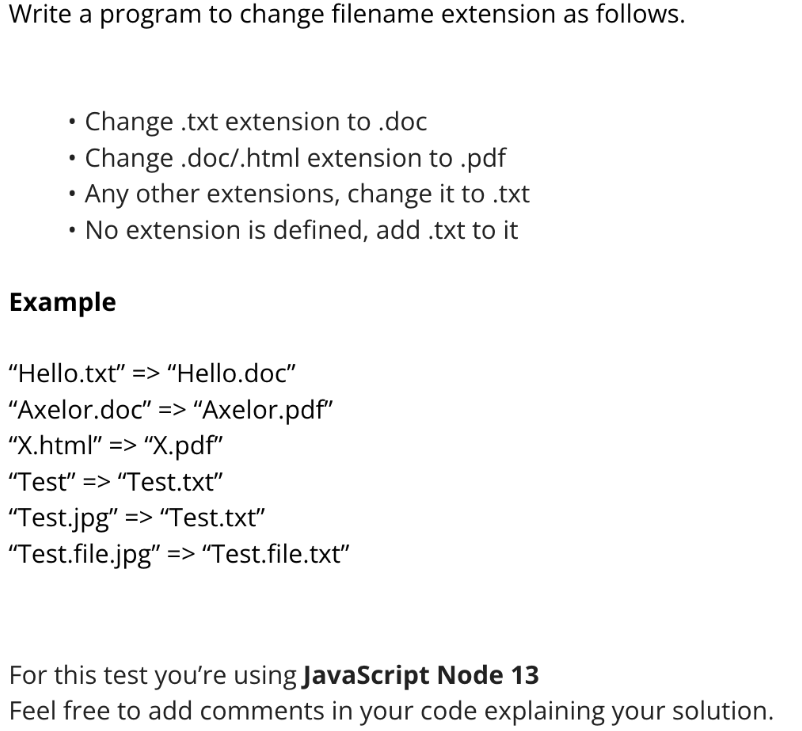

## DSA :-

## 1 - Identify and eliminate duplicate words from the given string, then display the modified string. "big black bug bit a big black dog on his big black nose".

### solution - 
const str = "big black bug bit a big black dog on his big black nose";

let arr = str.split(' ');

let ans = new Map();

for (let i = 0; i < arr.length; i++) {
    if(ans.has(arr[i]))
    {
        let count = ans.get(arr[i]);
        ans.set(arr[i], count + 1);
    }
    else {
        ans.set(arr[i], 1);
    }
}

let result = "";

for (const key of ans.keys()) {
    result = result +" "+ key;
}

console.log(result);

### output - 

big black bug bit a dog on his nose

## 2. Tell the output of - Console.log("2"+2).

### output - 

22.

## 3. Swap KEY : Value
let obj = {
a : 1
b : 2
}

### solution -

let swapped = {};

for (let key in obj) {
  let value = obj[key];
  swapped[value] = key;
}

console.log(swapped);

### output - 

{ '1': 'a', '2': 'b' }

## 4. How will you know if a number given falls under fibonacci series or not?

### solution - 

function isPerfectSquare(x) {
  let s = Math.sqrt(x);
  return s === Math.floor(s);
}

function isFibonacci(n) {
  return isPerfectSquare(5 * n * n + 4) || isPerfectSquare(5 * n * n - 4);
}

console.log(isFibonacci(21));
console.log(isFibonacci(22));

### output - 

true
false

## 5. Write a JavaScript program that accepts a number as input and inserts dashes (-) between each even number. For example if you accept 025468 the output should be 0-254-6-8.

### solution - 

let num = '025468';

let arr = num.split("");

let str = "";

for(let i=0; i<arr.length; i++)
{
     if(Number(arr[i]) % 2 === 0 && Number(arr[i+1]) % 2 === 0)
     {
        str += arr[i];
        str = str + '-';
     }else{
        str += arr[i];
     }
    
     
     
}

console.log(str);

### output - 

0-254-6-8

## 6. Using the reduce method, calculate and print the sum of elements in an array.

### solution - 

let num = [5,6,4,8,9,3,10];

let result = num.reduce((accumulator, currentValue) => {
   return accumulator + currentValue;
}, 0);

console.log(result);

### output - 

45

## 7. Create a timer whose by default value is 10 and value should decrease by 1 per second.

### solution - 

let num = 10;

let interval = setInterval(() => {
   console.log(num);
   num--;

   if(num < 0)
   {
      clearInterval(interval);
   }
   
}, 1000);

### output - 

10
9
8
7
6
5
4
3
2
1
0

## 8. Give me combined education data along with id and name - 

arr1 = [{age: 8, name: 'Hman', id: 1}, {age: 9, name: 'Iman', id: 2}, {age: 9.5, name: 'Kman', id: 3}, {age: 10, name: 'Jman', id: 4}]

arr2 = [{id: 1, edu: 'BCom'}, {id: 1, edu: 'Diploma'}, {id: 2, edu: 'BSc'}, {id: 2, edu: 'BA'}, {id: 3, edu: 'MSc'}, {id: 4, edu: 'BTech'}]

### solution - 

const eduMap = arr2.reduce((acc, curr) => {
  if (!acc[curr.id]) {
    acc[curr.id] = [];
  }
  acc[curr.id].push(curr.edu);
  return acc;
}, {});

const result = arr1.map(person => {
  return {
    name: person.name,
    id: person.id,
    qualification: eduMap[person.id] || []
  };
});

console.log(result);

### output - 

[{name: 'Hman', id: 1, qualification: [‘BCom’, 'Diploma' ]}]

## 9. let listData = [
{ id: 1, name: 'Discover Music' },
{ id: 2, pid: 1, name: 'Hot Singles' },
{ id: 3, pid: 1, name: 'Rising Artists' },
{ id: 4, pid: 1, name: 'Live Music' },
{ id: 6, pid: 1, name: 'Best of 2017 So Far' },
{ id: 7, name: 'Sales and Events' },
{ id: 8, pid: 7, name: '100 Albums' },
{ id: 9, pid: 7, name: 'Hip-Hop and R&B Sale' },
{ id: 10, pid: 7, name: 'CD Deals' },
{ id: 11, name: 'Categories' },
{ id: 12, pid: 11, name: 'Songs' },
{ id: 13, pid: 11, name: 'Best Selling Albums' },
{ id: 14, pid: 11, name: 'New Releases' },
{ id: 15, pid: 11, name: 'Best Selling Songs' },
{ id: 16, name: 'MP3 Albums'},
{ id: 17, pid: 16, name: 'Rock' },
{ id: 18, pid: 16, name: 'Gospel' },
{ id: 19, pid: 16, name: 'Latin Music' },
{ id: 20, pid: 16, name: 'Jazz' },
{ id: 21, name: 'More in Music' },
{ id: 22, pid: 21, name: 'Music' },
{ id: 22, pid: 21, name: 'Music Trade-In' },
{ id: 23, pid: 21, name: 'Redeem a Gift Card' },
{ id: 24, pid: 21, name: 'Band T-Shirts' },
]

### solution - 

const idMap = {};
listData.forEach(item => {
  idMap[item.id] = { ...item };
});

listData.forEach(item => {
  if (item.pid != null && idMap[item.pid]) {
    const parent = idMap[item.pid];
    if (!parent.childs) parent.childs = [];
    parent.childs.push(idMap[item.id]);
  }
});

const result = listData.filter(item => item.pid == null).map(item => idMap[item.id]);

console.log(JSON.stringify(result, null, 2));

### output - 

{ id: 1, name: 'Discover Music', childs:[
{ id: 2, pid: 1, name: 'Hot Singles' },
{ id: 3, pid: 1, name: 'Rising Artists' },
{ id: 4, pid: 1, name: 'Live Music' },
{ id: 6, pid: 1, name: 'Best of 2017 So Far' },
] }

## 10. const arrNum = [
[1, 2, 3],
[4, 5, 6],
[7, 8, 9],];

Replace with factorial array

### solution - 

const factorial = n => n <= 1 ? 1 : n * factorial(n - 1);

const arrNum = [
  [1, 2, 3],
  [4, 5, 6],
  [7, 8, 9],
];

const result = arrNum.map((inner, index) => {
  const value = inner[2 - index];
  return [factorial(value)];
});

console.log(result); // [ [6], [120], [504] ]

### output - 

[ [ 6 ], [ 120 ], [ 504 ] ]

## 11. Flat an array 

arr = [1,2,3,[5,[6,7],8],9]

### solution - 

const flattened = arr.flat(Infinity);

### output - 
Array = [1,2,3,4,5,6,7,8,9]

## 12. const inventory = 
[
{ name: "asparagus", type: "vegetables", quantity: 5 },
{ name: "bananas", type: "fruit", quantity: 0 },
{ name: "goat", type: "meat", quantity: 23 },
{ name: "cherries", type: "fruit", quantity: 5 },
{ name: "fish", type: "meat", quantity: 22 },
];

### solution - 

const grouped = inventory.reduce((acc, item) => {
  if (!acc[item.type]) {
    acc[item.type] = [];
  }
  acc[item.type].push(item);
  return acc;
}, {});

console.log(grouped);

### output - 

{
vegetables: [
{ name: 'asparagus', type: 'vegetables', quantity: 5 },
],
fruit: [
{ name: "bananas", type: "fruit", quantity: 0 },
{ name: "cherries", type: "fruit", quantity: 5 }
],
meat: [
{ name: "goat", type: "meat", quantity: 23 },
{ name: "fish", type: "meat", quantity: 22 }
] }

## 13. Code to give sum of diagonal

[[10,1,20,40,20],
[10,1,21,40,20],
[10,1,40,40,20],
[10,1,30,40,20],
[10,1,60,40,20] ]

### solution - 

const n = matrix.length;
let primary = 0;
let secondary = 0;

for (let i = 0; i < n; i++) {
  primary += matrix[i][i];
  secondary += matrix[i][n - 1 - i];
}

// If you want just the sum of both diagonals:
const total = primary + secondary;

console.log("Primary Diagonal Sum:", primary);
console.log("Secondary Diagonal Sum:", secondary);
console.log("Total Diagonal Sum:", total);

## 14. How to convert 24 hours format to 12 hours in Javascript.

### solution - 

function convertTo12Hour(time24) {
  let [hours, minutes] = time24.split(":").map(Number);
  const ampm = hours >= 12 ? "PM" : "AM";
  hours = hours % 12 || 12; // Convert '0' to '12'
  return `${hours}:${minutes.toString().padStart(2, "0")} ${ampm}`;
}

console.log(convertTo12Hour("00:00")); // 12:00 AM
console.log(convertTo12Hour("12:00")); // 12:00 PM
console.log(convertTo12Hour("18:30")); // 6:30 PM

## 15. 

# javascript_assignments
